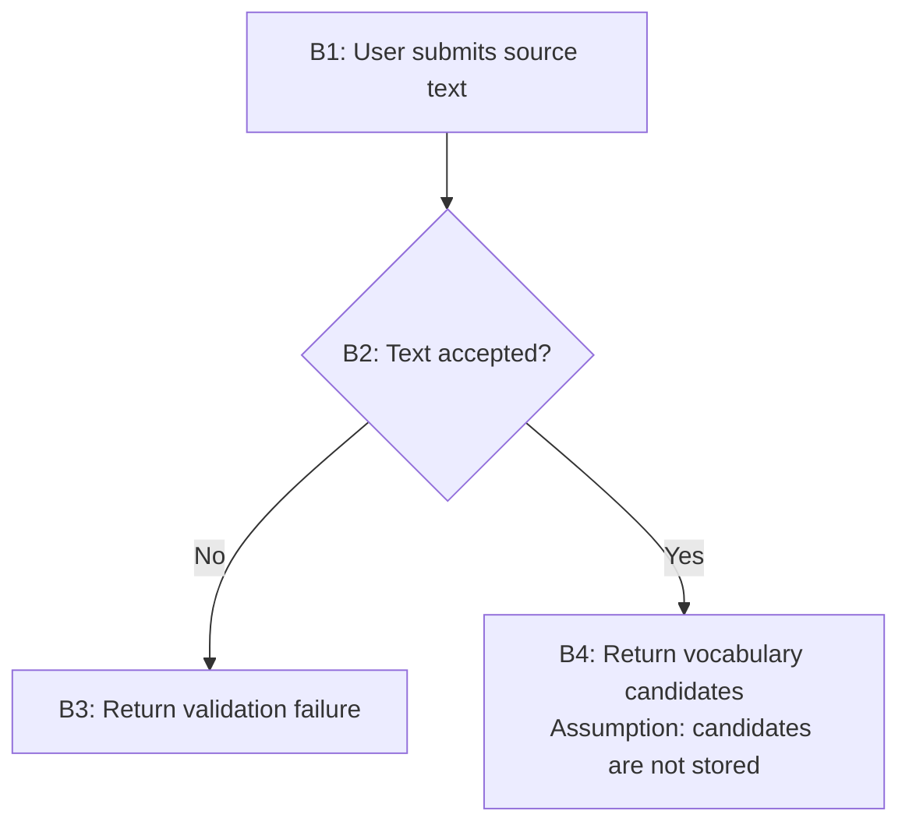

# Conceptual planning

Answer one question only: what should feature do?

## Allowed inputs

- Feature request
- User clarification answers
- Explicitly provided project constraints
- Configured development flow, limited to process constraints and layer vocabulary

No repository access. No code search. No project files. No framework skills. No feasibility claims.

## Clarify material uncertainty

Ask only when answer changes observable behavior, branch, failure path, stored state, external side effect, actor permission, inclusion rule, or exclusion rule.

Ask small batches. One answer may remove later questions. Never ask technical naming, class, file, framework, database, or test questions.

When uncertainty can remain visible without blocking discussion, record material assumption instead of inventing hidden behavior.

Material assumption affects:

- User-visible result
- Branch or failure outcome
- Stored state or external side effect
- Inclusion or exclusion
- Actor access or authorization behavior

Do not include transport, framework, persistence, or code-shape assumptions.

## Generate behavior flow

Create compact Mermaid diagram. Give every behavior stable ID: `B1`, `B2`, `B3`. Show actors, decisions, success paths, material failure paths, and observable results.

Embed assumption in node only when needed to understand that behavior. Add short inclusions and exclusions after diagram only when diagram cannot express them cleanly.

Do not include classes, files, endpoints, schemas, annotations, framework names, test cases, retries, or implementation steps unless user made them observable product requirements.

## Request approval

Output only:

1. Clarification questions, when required; or
2. Behavior diagram, material assumptions, inclusions/exclusions, and explicit conceptual approval request.

Approval must be explicit. Any behavior edit invalidates prior approval. Name revisions `draft-v1`, `approved-v1`, `draft-v2`, `approved-v2`.

Do not save project artifact here. Return approved diagram and revision to next lifecycle stage.
